<div align="center">


<br/>


</div>

## About Me

I'm a Computer Science student at **Patan Multiple Campus, Tribhuvan University**, based in Nepal 🇳🇵, working at the intersection of:

<div align="center">


</div>

I'm currently building strong foundations in software engineering while gradually moving toward AI/ML, using what I learn to build real products for students, not just portfolio projects.

```txt
const nischal = {
  location: "Nepal",
  degree: "BSc CSIT, Tribhuvan University",
  focus: ["Software Engineering", "Artificial Intelligence", "EdTech"],
  currentlyBuilding: "An EdTech platform for Nepali students",
  currentlyLearning: "Python for AI, ML foundations",
  philosophy: "Fundamentals > frameworks. Substance > certificates."
};
```


## What I'm Working On

<table>
<tr>
<td width="33%" align="center">


### EdTech Platform

Building an education platform for Nepali students, starting with an **After SEE** product: resources, mock exams, question banks, and progress tracking.

</td>
<td width="33%" align="center">


### Content

Creating educational content that makes hard concepts click.

</td>
<td width="33%" align="center">


### Skills

Going deeper into real software engineering fundamentals: DSA, systems, and eventually ML/DL.

</td>
</tr>
</table>


## Tech Stack

<div align="center">


<br/><br/>


</div>

<br/>

## My Roadmap

```mermaid
graph LR
    A[Web Dev Foundations] -->|in progress| B[Software Engineering]
    B --> C[Python & Data]
    C --> D[Machine Learning]
    D --> E[Deep Learning]
    E --> F[AI Research]

    style A fill:#4CC9F0,stroke:#0f2027,color:#0f2027,stroke-width:2px
    style B fill:#4361EE,stroke:#4CC9F0,color:#ffffff,stroke-width:2px
    style C fill:#3A0CA3,stroke:#4CC9F0,color:#ffffff,stroke-width:2px
    style D fill:#7209B7,stroke:#4CC9F0,color:#ffffff,stroke-width:2px
    style E fill:#B5179E,stroke:#4CC9F0,color:#ffffff,stroke-width:2px
    style F fill:#F72585,stroke:#4CC9F0,color:#ffffff,stroke-width:2px
```



<div align="center">

**Foundations → Projects → Advanced AI → Research**

</div>

I care more about evidence of learning than the number of repos or buzzwords on a profile. Every project here is meant to prove something I actually understand.


> My stack is still evolving. I pick tools based on the problem I'm solving, not what's trending. Right now that means shipping fast on the web while building toward Python and machine learning underneath.


## Principles

| | |
|---|---|
| 🛠️ **Build with purpose** | Solve real problems, not just portfolio filler |
| 📐 **Fundamentals first** | Tools change fast. Strong fundamentals don't |
| 🤖 **Use AI responsibly** | To accelerate learning, never to replace understanding |
| 🧪 **Learn by building** | Theory sticks when it's applied to real systems |


<div align="center">

### Let's Connect

Interested in Computer Science, AI, EdTech, or building things? Feel free to reach out. Always open to good conversations.


</div>
